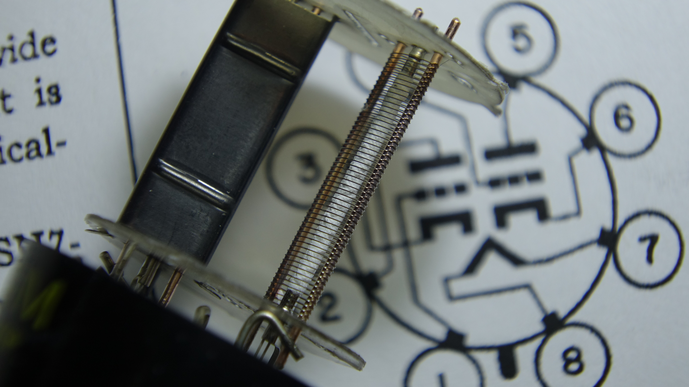

# Interactive Triode Simulation (Blender)

> **Start here → [LESSONS.md](LESSONS.md)** — a guided 11-lesson path through
> all three simulations in this repo, from thermionic emission to bias choice
> and distortion character in audio and guitar amplifier stages.

A physically-motivated teaching model of a vacuum triode: thermionic emission,
space-charge cloud, grid control and plate extraction — with live sliders and
cameras inside the tube. Geometry is a stylized 6SN7 internal assembly with
electrode gaps exaggerated ~3× so the physics is visible.

*The real thing: plate (left) opened away from the grid helix and its support
rods; the white-coated cathode runs up the middle of the grid. This photo set
the model's geometry.*

## Files

- `triode_sim.blend` — ready to open (script also embedded as a text block)
- `triode_sim.py`    — standalone builder: `blender -P triode_sim.py` rebuilds
  the whole scene from nothing
- `shots/`           — rendered stills of the key operating points
- `img/`             — macro photo of the real 6SN7 internal assembly the
  model is based on
- `PROMPT.md`        — the original challenge prompt, verbatim
- `PLAN.md`          — the implementation plan as approved

## Run it

1. Open `triode_sim.blend`.
2. The electron engine is a Python frame handler, which Blender does not
   persist across sessions: open the **Text Editor**, select `triode_sim.py`,
   press **Run Script** once (or run `blender -P triode_sim.py` instead).
3. In the 3D view press **N** → **Triode** tab.
4. Press **Run / Pause**, then drag sliders while it plays.

## Controls (Triode tab)

| Control | Range | What it teaches |
|---|---|---|
| Heater temp | 300–1300 K | Emission is exponential in T: below ~700 K the tube is dead no matter what the plate does. Heater/cathode glow follows. |
| Grid voltage | −20…+10 V | Small negative voltages throttle a large plate current (amplification, μ≈20). Below ≈ −Vp/20: cutoff — the cloud stays trapped at the cathode. Positive: extra current, but electrons start slamming into the grid wires (grid current). |
| Plate voltage | 0–300 V | Extraction field. Low Vp: electrons pile up as a space-charge cloud (Ip ≈ 0). Raising Vp drains the cloud through the grid gaps — watch Ip on the meter. |
| Top / Inside / Overview | — | Top = cross-section down the axis. Inside = standing between grid and plate. Overview = whole tube. Free-fly with walk mode (`Shift+\``) — the sim keeps running. |

Plate current shows on the glowing meter and in the panel, with the live
space-charge population next to it.

## Five experiments for students

1. **Cold tube**: T=500 K, Vp=250 V → nothing. Voltage alone moves no charge.
2. **Space charge**: T=1100 K, Vg=0, Vp=20 → dense cloud hugs the cathode, Ip≈0.
3. **Extraction**: raise Vp to 250 → the cloud drains, radial streams, Ip>20 mA.
4. **Cutoff**: Vp=150, drag Vg to −8 → current dies while the cloud is compressed
   against the cathode; the grid never touches an electron, its *field* does the work.
5. **Grid current**: Vg=+6 → watch electrons get captured by the grid wires
   (interception count in the panel).

## Physics model (honest summary)

Pedagogical, not TCAD: cylindrical-radial fields with an effective potential
`Vg + Vp/μ` between cathode and grid (μ=20 → cutoff at −Vp/μ by construction),
`Vp − Vg` between grid and plate, a local 1/d² grid-wire term (repulsion/gap
focusing when negative, attraction + capture when positive), Richardson-style
emission `∝ exp(−13000·(1/T − 1/1100))`, and a mean-field space-charge term that
throttles emission and depresses the cathode field as the cloud fills — which is
what makes the Ip(Vp) knee and cloud saturation emerge. Integrated per frame
(1/24 s, 4 substeps, ~6000-electron pool) in a `frame_change_pre` handler with
numpy; electrons are dupli-vert instanced emissive spheres.

Notes: the sim is stateful — timeline scrubbing doesn't rewind it; use Reset.
If you drive Blender over MCP while playback runs, expect a little extra latency.
